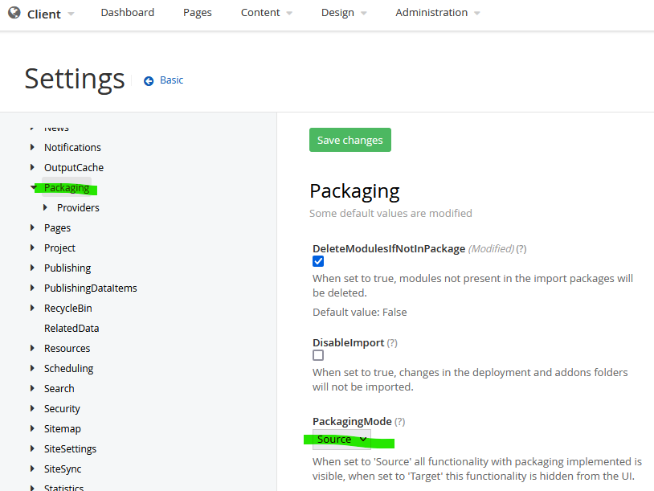
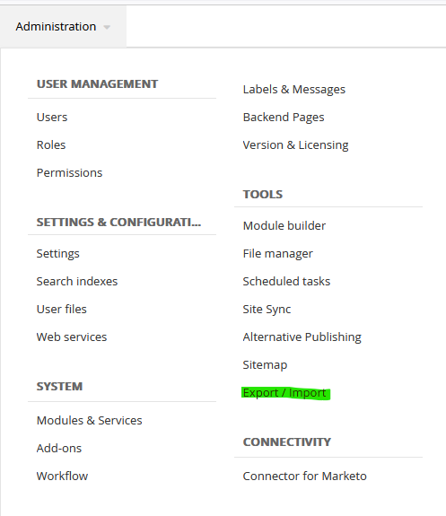
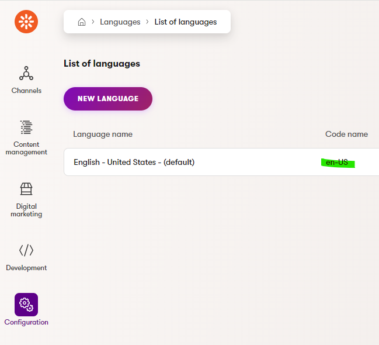

# Usage Guide


1. Download the package from the repository [Releases](https://github.com/Kentico/xperience-by-kentico-sitefinity-migration-tool/releases)
    - Optionally, clone the git repository and build from the source files.
``` git clone -v "https://github.com/Kentico/xperience-by-kentico-sitecore-migration-tool.git" "{YOUR PATH}"```

1. Modify the console application's configuration file `/examples/Migration.Toolkit.Sitefinity.Console/appsettings.json` 
    - The details for configuration options can be found below. 
1. Set up Sitefinity 
    - Enable 'Deployment Mode' is set to 'source'. This feature will export the content type definitions from the database and store them on the disk. Like XbyK's Continuous Integration (CI) files. 
    [More information in the Sitefinity docs.](https://www.progress.com/documentation/sitefinity-cms/deployment-mode) 
    - Once this is set, there is a menu item under *Administration* for Export / Import 
    - Use Sitefinity's 'Export for Deployment' feature to create content type files.  In the main navigation under *Administration » Export / Import* Select 'Export for Deployment' from the left navigation and click 'Export'. The path displayed here will be the value of ModuleDeploymentFolderPath in the appsettings.json file. The default value for this path is ~\App_Data\Sitefinity\Deployment 
    - Check the default language for source Sitefinity site site, it must match what is in XbyK. Look in *Administration >> Settings >> Basic >> Language*  
    - Make sure the Sitefinity content API is set to allow all content and is enabled. View the web service configuration under *Administration >> Web services >> Default*  In the configuration options for 'Default' make sure all content types are selected and 'This service is active' is checked/true.
    
1. Set up XbyK
    - Check that the XbyK default language matches the default language of the Sitefinity source site being migrated e.g. 'en-us' 
1. Make a back up of your XbyK database in case there are issues with the migration
1. Execute the `dotnet run` command from an elevated command prompt
1. Check the destination XbyK admin for correctness
    - Channels/Web Sites
    - Users
    - Page Types
    - Pages
    - Content Hub Items
    - Languages
    - Media
1. Adjust the configuration options as needed to correct any migration issues
1. Remigrate as needed - content will be overwritten in XbyK with changes from Sitefinity - the tool is smart enough to only migrate new or updated content.
1. As a good practice, backup XbyK database before each remigation attempt in case there is a need to go back to an earlier version 
1. If necessary, creating a new, empty XbyK database is very simple using `dotnet kentico-xperience-dbmanager` be sure to adjust connection string in appsettings.json if the details change.

## Details about the configuration file options ##
```
{
  "Logging": {
    "LogLevel": {
      "Default": "Debug",
      "System": "Information",
      "Microsoft": "Information"
    }
  },
  "CMSHashStringSalt": "HASH#HASH#HASH",
  "ConnectionStrings": {
    "CMSConnectionString": "[#YOUR CONNECTION STRING TO XbyK HERE]",
    "SitefinityConnectionString": "[#YOUR CONNECTION STRING TO Sitefinity HERE]"
  },
  "Sitefinity": {
    "Domain": "[#YOUR SITE ORIGIN HERE]",
    "WebServicePath": "api/default",
    "WebServiceApiKey": "[Optional, only needed if an API key is set]",
    "ModuleDeploymentFolderPath": "~/App_Data/Sitefinity/Deployment",
    "CodeNamePrefix": "[#YOUR SITE'S CODENAME PREFIX]",
    "PageContentTypes": [
      {
        "TypeName": "[#NAME OF DYNAMIC MODULE TYPE]",
        "PageRootPath": "[#ROOT PATH FOR DYNAMIC MODULE TYPE]",
        "ItemURLName": "[Optional, only needed if this is different from PageRootPath]",
        "PageTemplateType": "[Either 'Detail' or 'Listing']" 
      }
    ]
  },
  "WebApplicationPhysicalPath": "[#YOUR PATH TO XbyK INSTANCE#]"
}

```
### Logging ###
Common json configuration options for [Microsoft.Extensions.Logging](https://learn.microsoft.com/en-us/dotnet/core/extensions/logging?tabs=command-line#configure-logging-without-code) are allowed here.
### CMSHashStringSalt ### 
Salt copied from XbyK appsettings.json file.
### ConnectionStrings/CMSConnectionString ### 
Database connection to your destination XbyK instance, commonly copied from \appsettings.json
### ConnectionStrings/SitefinityConnectionString ###
This tool pulls some date from the Sitefinity database directly. Add the database connection to your source Sitefinity instance, commonly copied from \App_Data\Sitefinity\Configuration\Data.config
### Sitefinity/Domain ###
The URL of your running source Sitefinity instance. This tool uses the Sitefinity content API, it is necessary to have it accessible. Do not include the protocol or trailing slash e.g. local.examplesite.com
### Sitefinity/WebServicePath ###
Sitefinity path to the 'Default' API endpoint. It is required to have this 'Default' web service enabled. Check if it is enabled and the path inside the Sitefinity Admin under *Administration >> Web Services >> Default*. It is also necessary to enable the web service to expose all content to be migrated.

### (Optional) Sitefinity/WebServiceApiKey ###
(optional) if the web service endpoint is configured to have a key, enter it in the here.
### Sitefinity/ModuleDeploymentFolderPath ###
Ths tool requires ... will store temporary output files, they will be stored in this local directly
### Sitefinity/CodeNamePrefix ###
The destination XbyK site to target for this migration 
### Sitefinity/PageContentTypes ###
A list of type and their root page path. Sitefinity allows for content 'details' to be displayed from a single 'listing' page. e.g. A news 'listing' page will link to a large number of news 'details' pages. This pattern is different in XbyK. To support the strong page types in XbyK you must list these 'listing' pages and their types so they can be migrated and the child pages created. List out the Sitefinity content type that each 'listing' page displays. This tool will migrate the root page and all the child pages.

example:
```
    "PageContentTypes": [
      {
        "TypeName": "Region",
        "PageRootPath": "/Regions",
        "ItemURLName": "/Global-Regions",
        "PageTemplateType": "Detail" 
      }
      {
        "TypeName": "Blog",
        "PageRootPath": "/Sports-Blog",
        "PageTemplateType": "Detail" 
      }
      {
        "TypeName": "Blog",
        "PageRootPath": "/Events-Blog",
        "ItemURLName": "/Events",
        "PageTemplateType": "Listing" 
      }
      {
        "TypeName": "Author",
        "PageRootPath": "/News/Authors"
        "PageTemplateType": "Detail" 
      }
    ]

```
### WebApplicationPhysicalPath ###
: Path to the destination XbyK instance. Needed for the media import. Exclude the trailing slash e.g. c:\develop\my_xby_site