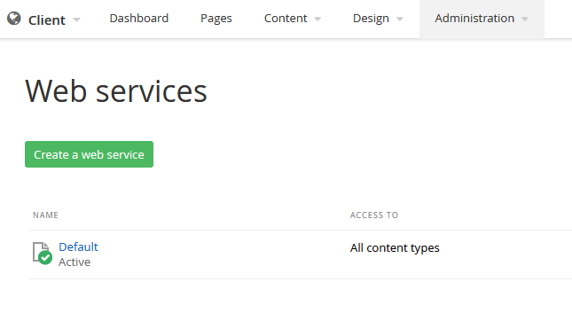

# Usage Guide

1. Download the package from the repository [Releases](https://github.com/Kentico/xperience-by-kentico-sitefinity-migration-tool/releases)

   - Optionally, clone the git repository and build from the source files.
   - ` git clone -v "https://github.com/Kentico/xperience-by-kentico-sitecore-migration-tool.git" "{YOUR PATH}"`

2. Modify the console application's configuration file `/examples/Migration.Toolkit.Sitefinity.Console/appsettings.json`
   - The details for configuration options can be found below.
3. Modify code for any additional customizations
   - Entity Framework is included. Add additional custom models to Migration.Toolkit.Sitefinity.Data.Core.EF.SitefinityContext for any custom tables. An additional import service will need to be created. See other import services.
   - Use the RestSdkBase when creating a provider that calls the rest api endpoints. This will ensure the rest client is running and provides methods to call the rest client.
   - Add additional field types for custom field types. See '/src/Migration.Toolkit.Sitefinity/FieldTypes' for OOB field types in Sitefinity. Using the IFieldType, will automatically add it to the import processing. You can also use the FieldTypeBase to handle the defaults.
4. Set up Sitefinity
   - Ensure 'Deployment Mode' is set to 'source'. This feature will export the content type definitions from the database and store them on the disk. Like XbyK's Continuous Integration (CI) files. 
     [More information in the Sitefinity docs.](https://www.progress.com/documentation/sitefinity-cms/deployment-mode)
   - Once this is set, there is a menu item under _Administration_ for Export / Import 
   - Use Sitefinity's 'Export for Deployment' feature to create content type files. In the main navigation under _Administration » Export / Import_ Select 'Export for Deployment' from the left navigation and click 'Export'. The path displayed here will be the value of ModuleDeploymentFolderPath in the appsettings.json file. Ensure you use the full path to the folder in the setting. The default value for this path is ~\App_Data\Sitefinity\Deployment 
   - Check the default language for source Sitefinity site, it must match what is in XbyK. Look in _Administration >> Settings >> Basic >> Language_
   - Make sure the Sitefinity content API is set to allow all content and is enabled. View the web service configuration under _Administration >> Web services >> Default_  In the configuration options for 'Default' make sure all content types are selected and 'This service is active' is checked/true.
     
5. Set up XbyK
   - Modify the XbyK default language to match the default language of the Sitefinity source site being migrated e.g. 'en-us'. Sitefinity's default English culture is 'en'. .
6. Make a back up of your XbyK database in case there are issues with the migration
7. Execute the `dotnet run` command from an elevated command prompt
8. Check the destination XbyK admin for correctness
   - Channels/Web Sites
   - Users
   - Content Types
   - Pages
   - Content Hub Items
   - Languages
   - Media Libaries & Media
9. Adjust the configuration options as needed to correct any migration issues
10. Remigrate as needed - content will be overwritten in XbyK with changes from Sitefinity - the tool is smart enough to only migrate new or updated content.
11. As a good practice, backup XbyK database before each remigation attempt in case there is a need to go back to an earlier version
12. If necessary, creating a new, empty XbyK database is very simple using `dotnet kentico-xperience-dbmanager`. Be sure to adjust connection string in appsettings.json if the details change.

## Details about the configuration file options

```
{
  "Logging": {
    "LogLevel": {
      "Default": "Debug",
      "System": "Information",
      "Microsoft": "Information"
    }
  },
  "CMSHashStringSalt": "HASH#HASH#HASH",
  "ConnectionStrings": {
    "CMSConnectionString": "[#YOUR CONNECTION STRING TO XbyK HERE]",
    "SitefinityConnectionString": "[#YOUR CONNECTION STRING TO Sitefinity HERE]"
  },
  "Sitefinity": {
    "Domain": "[#YOUR SITE ORIGIN HERE]",
    "WebServicePath": "api/default",
    "WebServiceApiKey": "[#YOUR SITE API KEY HERE (OPTIONAL)]",
    "ModuleDeploymentFolderPath": "[#ABSOLUTE PATH TO Sitefinity DEPLOYMENT FOLDER]",
    "CodeNamePrefix": "[#YOUR SITE'S CODENAME PREFIX]",
    "PageContentTypes": [
      {
        "TypeName": "[#NAME OF DYNAMIC MODULE TYPE]",
        "PageRootPath": "[#PAGE ROOT PATH WHERE DYNAMIC MODULE TYPE'S WIDGET IS PLACED]",
        "ItemUrlName": "[#SPECIFIC URLNAME OF CONTENT ITEM TO SHOW. USED WITH DETAIL TEMPLATE TYPE. (OPTIONAL)]",
        "PageTemplateType": "[#TEMPLATE OF WIDGET ON PAGE. OPTIONS ARE LISTING OR DETAIL.]"
      }
    ]
  },
  "WebApplicationPhysicalPath": "[#YOUR PATH TO XbyK INSTANCE#]"
}

```

### Logging

Common json configuration options for [Microsoft.Extensions.Logging](https://learn.microsoft.com/en-us/dotnet/core/extensions/logging?tabs=command-line#configure-logging-without-code) are allowed here.

### CMSHashStringSalt

Salt copied from XbyK appsettings.json file.

### ConnectionStrings/CMSConnectionString

Database connection to your destination XbyK instance, commonly copied from \appsettings.json

### ConnectionStrings/SitefinityConnectionString

This tool pulls some data from the Sitefinity database directly. Add the database connection to your source Sitefinity instance, commonly copied from \App_Data\Sitefinity\Configuration\Data.config

### Sitefinity/Domain

The domain of your running source Sitefinity instance. This tool uses the Sitefinity content API, it is necessary to have it accessible. Do not include the protocol or trailing slash e.g. local.examplesite.com

### Sitefinity/WebServicePath

Sitefinity path to the 'Default' API endpoint. It is required to have this 'Default' web service enabled. Check if it is enabled and the path inside the Sitefinity Admin under _Administration >> Web Services >> Default_. It is also necessary to enable the web service to expose all content to be migrated.

### (Optional) Sitefinity/WebServiceApiKey

(optional) if the web service endpoint is configured to have a key, enter it in the here.

### Sitefinity/ModuleDeploymentFolderPath

**Absolute path** to the deployment folder created by the 'Export for Deployment' process in Sitefinity. This tool requires the deployment folder and type definitions in order to import the content types required for the content items and pages.

### Sitefinity/CodeNamePrefix

Codename prefix for all content types. Typically the name of your site. Do not use CMS or OM.

### Sitefinity/PageContentTypes

A list of types that are considered to be pages such as, news, blogs, etc. Sitefinity allows for content 'detail' pages to be displayed from a single 'listing' page. e.g. A news 'listing' page will link to a large number of news 'detail' pages. This pattern is different in XbyK. To support the strong page types in XbyK you must configure the PageContentTypes. If they are not configured, all content items will be placed in the Content Hub and will no longer have their hierarchical structure or url structure. See below for which PageTemplateType should be used.

Sitefinity allows users to add a listing widget for any particular static or dynamic type. When a listing widget is added to the page, Sitefinity will consider that page url to be the root of the items that are specified for that listing. For example, a news listing widget may be on '/news'. If a user opened a news item with the urlname of '/example-1', the url would be '/news/example-1' and Sitefinity would dynamically render the page for that url. In Sitefinity, the item for '/example-1' would still live in the news content items but in XbyK, we need that content item to live under '/news'. To mimic this behavior in XbyK, you would add the following record.

```
{
  "TypeName": "NewsItem",
  "PageRootPath": "/news",
  "PageTemplateType": "Listing"
}
```

Sitefinity also allows the user to use the same widget as a detail view. This allows the content editor to select a particular item and render the content as if the structured content was part of the page itself. If the item being shown also had child items, they would typically render in a listing as part of the content. To import a content item as a detail page and the structured content to be associated with that page, the detail template type will need to be added to the configuration. For example, a user may have a page named "/blog-one" that contains the blog detail widget with the "/blog-1" content item selected. The page would render the content for "/blog-1" and show any child blog items as a listing. When navigating to those blog items, the "/blog-one" url will be prepended. For example, "/blog-one/blog-item-1". To mimic this behavior in XbyK, you would add the following record.

```
{
  "TypeName": "Blog",
  "PageRootPath": "/blog-one",
  "ItemURLName": "/blog-1", // If this is not set, the import will look for a content item using the PageRootPath.
  "PageTemplateType": "Detail"
}
```

Complete Example:

```
    "PageContentTypes": [
      {
        "TypeName": "Region",
        "PageRootPath": "/regions",
        "PageTemplateType": "Listing"
      },
      {
        "TypeName": "NewsItem",
        "PageRootPath": "/news",
        "PageTemplateType": "Listing"
      },
      {
        "TypeName": "Blog",
        "PageRootPath": "/sports-blog",
        "PageTemplateType": "Detail"
      },
      {
        "TypeName": "Blog",
        "PageRootPath": "/blog-one",
        "ItemURLName": "/blog-1",
        "PageTemplateType": "Detail"
      },
      {
        "TypeName": "Author",
        "PageRootPath": "/News/Authors"
        "PageTemplateType": "Listing"
      }
    ]

```

### WebApplicationPhysicalPath

Path to the destination XbyK instance. Needed for the media import. Exclude the trailing slash e.g. c:\develop\my_xby_site
